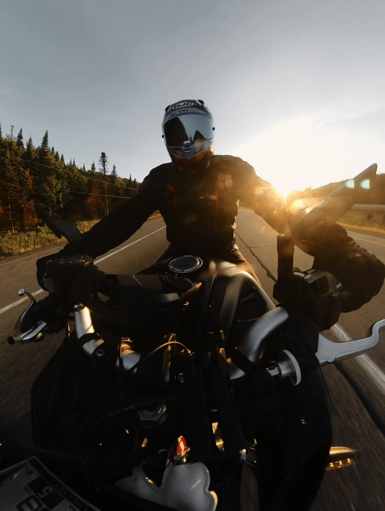

# Código listo para agregar tus miniaturas y links de video

Cómo usar este documento:
1. Busca la sección con el nombre del video/ruta/tutorial que quieres actualizar.
2. Copia el bloque de código completo.
3. Ábrelo en tu editor y reemplaza:
   - `TU_LINK_YOUTUBE` → el link real de YouTube (normal o `/shorts/...`)
   - `img/NOMBRE-AQUI.jpg` → el nombre de tu foto real, ya puesta en la carpeta `img/`
4. Busca el bloque **viejo** correspondiente en el archivo `.html` (el nombre del archivo está indicado en cada sección) y reemplázalo completo por el nuevo.
5. Guarda, y sigue la guía de [GUIDE-EDITION.md](GUIDE-EDITION.md) para subirlo a GitHub.

⚠️ Ya hecho (no lo toques): el video de **Mont-Tremblant** en `index.html` (sección "Dernières vidéos") ya está conectado y funcionando.

---

## `index.html` — Dernières vidéos

### Chevreuil sur un rang près de Saint-Hyacinthe

```html
<a href="TU_LINK_YOUTUBE" target="_blank" rel="noopener" class="col-span-12 sm:col-span-6 lg:col-span-3 card reveal" data-reveal>
  <div class="card__media">
    
    <span class="card__play absolute"><svg width="16" height="16" viewBox="0 0 24 24" fill="currentColor" aria-hidden="true"><path d="M8 5v14l11-7z"/></svg></span>
  </div>
  <div class="card__body">
    <span class="card__meta">Sécurité · 12 min</span>
    <h3 class="card__title">Chevreuil sur un rang près de Saint-Hyacinthe</h3>
    <p class="card__text">Ce que cette frayeur m'a appris sur l'anticipation.</p>
  </div>
  <div class="card__footer"><span>3,2 k vues</span><span>Il y a 2 jours</span></div>
</a>
```

### Check-list complète avant la saison

```html
<a href="TU_LINK_YOUTUBE" target="_blank" rel="noopener" class="col-span-12 sm:col-span-6 lg:col-span-3 card reveal" data-reveal>
  <div class="card__media">
    
    <span class="card__play absolute"><svg width="16" height="16" viewBox="0 0 24 24" fill="currentColor" aria-hidden="true"><path d="M8 5v14l11-7z"/></svg></span>
  </div>
  <div class="card__body">
    <span class="card__meta">Entretien · 9 min</span>
    <h3 class="card__title">Check-list complète avant la saison</h3>
    <p class="card__text">Les 10 points à vérifier avant votre premier départ.</p>
  </div>
  <div class="card__footer"><span>5,8 k vues</span><span>Il y a 1 semaine</span></div>
</a>
```

### Freinage d'urgence : la technique qui sauve

```html
<a href="TU_LINK_YOUTUBE" target="_blank" rel="noopener" class="col-span-12 sm:col-span-6 lg:col-span-3 card reveal" data-reveal>
  <div class="card__media">
    
    <span class="card__play absolute"><svg width="16" height="16" viewBox="0 0 24 24" fill="currentColor" aria-hidden="true"><path d="M8 5v14l11-7z"/></svg></span>
  </div>
  <div class="card__body">
    <span class="card__meta">Conduite · 14 min</span>
    <h3 class="card__title">Freinage d'urgence : la technique qui sauve</h3>
    <p class="card__text">L'exercice à pratiquer dans un stationnement vide.</p>
  </div>
  <div class="card__footer"><span>4,4 k vues</span><span>Il y a 1 mois</span></div>
</a>
```

---

## `routes.html` — Mes sorties près de chez moi

### Mont-Saint-Hilaire

```html
<a href="TU_LINK_YOUTUBE" target="_blank" rel="noopener" class="col-span-12 sm:col-span-6 lg:col-span-4 card reveal" data-reveal>
  <div class="card__media">
    
    <span class="card__play absolute"><svg width="16" height="16" viewBox="0 0 24 24" fill="currentColor" aria-hidden="true"><path d="M8 5v14l11-7z"/></svg></span>
  </div>
  <div class="card__body">
    <div class="flex items-center justify-between">
      <h3 class="card__title">Mont-Saint-Hilaire</h3>
      <span class="badge badge--easy">Facile</span>
    </div>
    <p class="card__text">Une courte sortie de fin de journée, parfaite pour un premier tour après le travail.</p>
  </div>
  <div class="card__footer"><span>~30 km · 45 min</span></div>
</a>
```

### Mont Rougemont

```html
<a href="TU_LINK_YOUTUBE" target="_blank" rel="noopener" class="col-span-12 sm:col-span-6 lg:col-span-4 card reveal" data-reveal>
  <div class="card__media">
    
    <span class="card__play absolute"><svg width="16" height="16" viewBox="0 0 24 24" fill="currentColor" aria-hidden="true"><path d="M8 5v14l11-7z"/></svg></span>
  </div>
  <div class="card__body">
    <div class="flex items-center justify-between">
      <h3 class="card__title">Mont Rougemont</h3>
      <span class="badge badge--easy">Facile</span>
    </div>
    <p class="card__text">Routes de campagne au milieu des vergers de la Montérégie. Idéal à l'automne.</p>
  </div>
  <div class="card__footer"><span>~20 km · 30 min</span></div>
</a>
```

### Granby

```html
<a href="TU_LINK_YOUTUBE" target="_blank" rel="noopener" class="col-span-12 sm:col-span-6 lg:col-span-4 card reveal" data-reveal>
  <div class="card__media">
    
    <span class="card__play absolute"><svg width="16" height="16" viewBox="0 0 24 24" fill="currentColor" aria-hidden="true"><path d="M8 5v14l11-7z"/></svg></span>
  </div>
  <div class="card__body">
    <div class="flex items-center justify-between">
      <h3 class="card__title">Granby</h3>
      <span class="badge badge--easy">Facile</span>
    </div>
    <p class="card__text">Routes secondaires tranquilles à travers la campagne de la Montérégie.</p>
  </div>
  <div class="card__footer"><span>~45 km · 1 h</span></div>
</a>
```

### Drummondville

```html
<a href="TU_LINK_YOUTUBE" target="_blank" rel="noopener" class="col-span-12 sm:col-span-6 lg:col-span-4 card reveal" data-reveal>
  <div class="card__media">
    
    <span class="card__play absolute"><svg width="16" height="16" viewBox="0 0 24 24" fill="currentColor" aria-hidden="true"><path d="M8 5v14l11-7z"/></svg></span>
  </div>
  <div class="card__body">
    <div class="flex items-center justify-between">
      <h3 class="card__title">Drummondville</h3>
      <span class="badge badge--easy">Facile</span>
    </div>
    <p class="card__text">Un aller-retour rapide sur des routes dégagées, parfait pour une sortie improvisée.</p>
  </div>
  <div class="card__footer"><span>~50 km · 1 h</span></div>
</a>
```

### Montréal

```html
<a href="TU_LINK_YOUTUBE" target="_blank" rel="noopener" class="col-span-12 sm:col-span-6 lg:col-span-4 card reveal" data-reveal>
  <div class="card__media">
    
    <span class="card__play absolute"><svg width="16" height="16" viewBox="0 0 24 24" fill="currentColor" aria-hidden="true"><path d="M8 5v14l11-7z"/></svg></span>
  </div>
  <div class="card__body">
    <div class="flex items-center justify-between">
      <h3 class="card__title">Montréal</h3>
      <span class="badge badge--medium">Modérée</span>
    </div>
    <p class="card__text">Circulation urbaine et autoroute — un bon test de maniabilité pour la M 1000 R.</p>
  </div>
  <div class="card__footer"><span>~55 km · 1 h</span></div>
</a>
```

### Mont-Tremblant (carte de la galerie de routes — différente de celle de l'accueil)

```html
<a href="TU_LINK_YOUTUBE" target="_blank" rel="noopener" class="col-span-12 sm:col-span-6 lg:col-span-4 card reveal" data-reveal>
  <div class="card__media">
    
    <span class="card__play absolute"><svg width="16" height="16" viewBox="0 0 24 24" fill="currentColor" aria-hidden="true"><path d="M8 5v14l11-7z"/></svg></span>
  </div>
  <div class="card__body">
    <div class="flex items-center justify-between">
      <h3 class="card__title">Mont-Tremblant</h3>
      <span class="badge badge--hard">Difficile</span>
    </div>
    <p class="card__text">Ma plus longue sortie à ce jour : routes de montagne, forêt dense et lacs à perte de vue.</p>
  </div>
  <div class="card__footer"><span>~180 km · 2-3 h</span></div>
</a>
```
*(Tu as déjà `img/mont-tremblant.jpg` — cette carte-ci peut réutiliser la même photo, ou une autre de la même sortie.)*

---

## `routes.html` — Vidéo vedette

Remplace seulement le lien (garde le reste) :

```html
<a href="TU_LINK_YOUTUBE" class="btn btn--primary mt-6" target="_blank" rel="noopener">Regarder sur YouTube</a>
```

Et si tu veux remplacer le dessin SVG par ta vraie miniature, remplace tout le bloc `card__media` :

```html
<div class="card__media !h-64">
  
  <button type="button" class="card__play absolute h-16 w-16" aria-label="Lire la vidéo vedette : Mont-Tremblant">
    <svg width="26" height="26" viewBox="0 0 24 24" fill="currentColor" aria-hidden="true"><path d="M8 5v14l11-7z"/></svg>
  </button>
</div>
```

---

## `tutoriels.html` — 9 tutoriels

### Vidange d'huile en 10 minutes

```html
<a href="TU_LINK_YOUTUBE" target="_blank" rel="noopener" class="col-span-12 sm:col-span-6 lg:col-span-4 card reveal" data-reveal data-category="entretien">
  <div class="card__media">
    
    <span class="card__play absolute"><svg width="16" height="16" viewBox="0 0 24 24" fill="currentColor" aria-hidden="true"><path d="M8 5v14l11-7z"/></svg></span>
  </div>
  <div class="card__body">
    <span class="card__meta">Entretien</span>
    <h3 class="card__title">Vidange d'huile en 10 minutes</h3>
    <p class="card__text">Le tutoriel le plus demandé : tout le matériel et les étapes, sans surprise.</p>
  </div>
  <div class="card__footer"><span>10 min</span></div>
</a>
```

### Vérifier et lubrifier sa chaîne

```html
<a href="TU_LINK_YOUTUBE" target="_blank" rel="noopener" class="col-span-12 sm:col-span-6 lg:col-span-4 card reveal" data-reveal data-category="entretien">
  <div class="card__media">
    
    <span class="card__play absolute"><svg width="16" height="16" viewBox="0 0 24 24" fill="currentColor" aria-hidden="true"><path d="M8 5v14l11-7z"/></svg></span>
  </div>
  <div class="card__body">
    <span class="card__meta">Entretien</span>
    <h3 class="card__title">Vérifier et lubrifier sa chaîne</h3>
    <p class="card__text">La tâche d'entretien la plus négligée — et la plus facile à faire soi-même.</p>
  </div>
  <div class="card__footer"><span>7 min</span></div>
</a>
```

### Bien préparer sa moto pour l'hiver

```html
<a href="TU_LINK_YOUTUBE" target="_blank" rel="noopener" class="col-span-12 sm:col-span-6 lg:col-span-4 card reveal" data-reveal data-category="entretien">
  <div class="card__media">
    
    <span class="card__play absolute"><svg width="16" height="16" viewBox="0 0 24 24" fill="currentColor" aria-hidden="true"><path d="M8 5v14l11-7z"/></svg></span>
  </div>
  <div class="card__body">
    <span class="card__meta">Entretien</span>
    <h3 class="card__title">Bien préparer sa moto pour l'hiver</h3>
    <p class="card__text">Batterie, essence, entreposage : les erreurs qui coûtent cher au printemps.</p>
  </div>
  <div class="card__footer"><span>15 min</span></div>
</a>
```

### Maîtriser les virages en épingle

```html
<a href="TU_LINK_YOUTUBE" target="_blank" rel="noopener" class="col-span-12 sm:col-span-6 lg:col-span-4 card reveal" data-reveal data-category="conduite">
  <div class="card__media">
    
    <span class="card__play absolute"><svg width="16" height="16" viewBox="0 0 24 24" fill="currentColor" aria-hidden="true"><path d="M8 5v14l11-7z"/></svg></span>
  </div>
  <div class="card__body">
    <span class="card__meta">Conduite</span>
    <h3 class="card__title">Maîtriser les virages en épingle</h3>
    <p class="card__text">Regard, trajectoire, contre-braquage : la technique expliquée simplement.</p>
  </div>
  <div class="card__footer"><span>13 min</span></div>
</a>
```

### Freinage d'urgence : la technique qui sauve (tutoriels.html)

```html
<a href="TU_LINK_YOUTUBE" target="_blank" rel="noopener" class="col-span-12 sm:col-span-6 lg:col-span-4 card reveal" data-reveal data-category="conduite">
  <div class="card__media">
    
    <span class="card__play absolute"><svg width="16" height="16" viewBox="0 0 24 24" fill="currentColor" aria-hidden="true"><path d="M8 5v14l11-7z"/></svg></span>
  </div>
  <div class="card__body">
    <span class="card__meta">Conduite</span>
    <h3 class="card__title">Freinage d'urgence : la technique qui sauve</h3>
    <p class="card__text">L'exercice à répéter jusqu'à ce qu'il devienne un réflexe.</p>
  </div>
  <div class="card__footer"><span>14 min</span></div>
</a>
```

### Rouler sous la pluie sans stresser

```html
<a href="TU_LINK_YOUTUBE" target="_blank" rel="noopener" class="col-span-12 sm:col-span-6 lg:col-span-4 card reveal" data-reveal data-category="conduite">
  <div class="card__media">
    
    <span class="card__play absolute"><svg width="16" height="16" viewBox="0 0 24 24" fill="currentColor" aria-hidden="true"><path d="M8 5v14l11-7z"/></svg></span>
  </div>
  <div class="card__body">
    <span class="card__meta">Conduite</span>
    <h3 class="card__title">Rouler sous la pluie sans stresser</h3>
    <p class="card__text">Pression des pneus, trajectoire, distance de suivi : mon protocole personnel.</p>
  </div>
  <div class="card__footer"><span>11 min</span></div>
</a>
```

### Choisir son casque : DOT vs ECE vs Snell

```html
<a href="TU_LINK_YOUTUBE" target="_blank" rel="noopener" class="col-span-12 sm:col-span-6 lg:col-span-4 card reveal" data-reveal data-category="securite">
  <div class="card__media">
    
    <span class="card__play absolute"><svg width="16" height="16" viewBox="0 0 24 24" fill="currentColor" aria-hidden="true"><path d="M8 5v14l11-7z"/></svg></span>
  </div>
  <div class="card__body">
    <span class="card__meta">Sécurité</span>
    <h3 class="card__title">Choisir son casque : DOT vs ECE vs Snell</h3>
    <p class="card__text">Ce que ces normes veulent vraiment dire pour votre protection.</p>
  </div>
  <div class="card__footer"><span>16 min</span></div>
</a>
```

### L'équipement ATGATT expliqué

```html
<a href="TU_LINK_YOUTUBE" target="_blank" rel="noopener" class="col-span-12 sm:col-span-6 lg:col-span-4 card reveal" data-reveal data-category="securite">
  <div class="card__media">
    
    <span class="card__play absolute"><svg width="16" height="16" viewBox="0 0 24 24" fill="currentColor" aria-hidden="true"><path d="M8 5v14l11-7z"/></svg></span>
  </div>
  <div class="card__body">
    <span class="card__meta">Sécurité</span>
    <h3 class="card__title">L'équipement ATGATT expliqué</h3>
    <p class="card__text">All The Gear, All The Time : pourquoi ce principe m'a évité des blessures graves.</p>
  </div>
  <div class="card__footer"><span>12 min</span></div>
</a>
```

### Angles morts : les erreurs qui tuent

```html
<a href="TU_LINK_YOUTUBE" target="_blank" rel="noopener" class="col-span-12 sm:col-span-6 lg:col-span-4 card reveal" data-reveal data-category="securite">
  <div class="card__media">
    
    <span class="card__play absolute"><svg width="16" height="16" viewBox="0 0 24 24" fill="currentColor" aria-hidden="true"><path d="M8 5v14l11-7z"/></svg></span>
  </div>
  <div class="card__body">
    <span class="card__meta">Sécurité</span>
    <h3 class="card__title">Angles morts : les erreurs qui tuent</h3>
    <p class="card__text">Comment je me positionne dans la circulation pour rester visible en tout temps.</p>
  </div>
  <div class="card__footer"><span>10 min</span></div>
</a>
```

---

## Consejos rápidos

- **No tienes fotos para todos todavía?** No hay problema — dile a ChatGPT/Claude "no tengo foto para X" y deja el bloque `<svg>...</svg>` original tal cual en lugar del ``, solo agregando el link con `<a href="TU_LINK_YOUTUBE">` alrededor. Ve el patrón de "Mont-Tremblant (Vidéo vedette)" arriba para un ejemplo de reemplazar solo el link.
- **Miniatura automática de YouTube** (si no tienes foto propia): usa `https://img.youtube.com/vi/EL_ID_DEL_VIDEO/maxresdefault.jpg` como `src` de la imagen — YouTube la genera sola.
- Después de cada cambio, corre `npx serve .` para ver cómo queda antes de subirlo.
